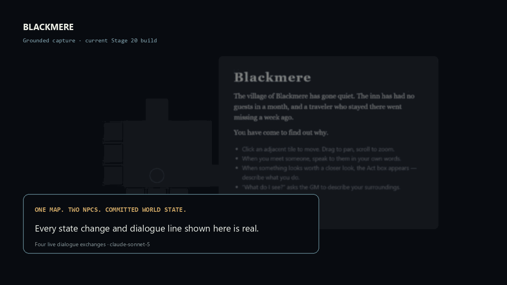
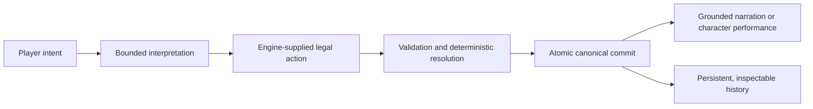

# Blackmere

**A small experiment in AI roleplay backed by a deterministic, inspectable world.**

Most AI roleplaying systems ask a language model to remember what is true. Blackmere takes a different approach: the game engine owns canonical state, while the model interprets language and performs characters from purpose-built, bounded context. Its output remains untrusted.

This 80-second walkthrough was assembled from one real playthrough, not a scripted video mock-up. The player moves through the current map, speaks with Mara, walks to Edda Vale's cottage, waits while canonical time and weather change, observes Edda arrive, and then speaks with her.

## What the walkthrough demonstrates

- Movement, visibility, discovered locations, and player knowledge are engine-owned.
- Waiting commits deterministic changes to elapsed time, weather, and NPC presence.
- Edda can be spoken to only after canonical state says she is physically present and nearby.
- Mara and Edda receive different authored knowledge and conversation histories.
- Model-proposed effects are validated before anything becomes true in the world.
- Turns persist across reload and can be undone without rerolling previously revealed chance.
- A development view exposes the context sent to the model and the state changes the engine accepted.

The model never receives authority to write directly to world state.

## The important distinction

Blackmere separates several things that an ordinary chat transcript tends to blur together:

| Layer | Authority |
| --- | --- |
| Canonical truth | Deterministic engine |
| What the player has perceived | Perception and knowledge state |
| What an NPC knows, believes, or remembers being told | Per-NPC state |
| Rules outcomes and random results | Engine, recorded in committed history |
| Language interpretation, prose, and character performance | AI model, treated as untrusted output |

That separation makes failures visible and containable. A character can say something unsupported without silently making it true.

## Honest limitations

This is a research prototype and compact vertical slice, not a complete RPG platform.

- Dialogue grounding is improved but not solved. In this captured playthrough, Edda says “no sign of them since,” implying an investigation result that was never established. The engine accepts no state change from that line, and the failure is called out in the walkthrough.
- The current map presentation is functional rather than beautiful. NPC presence is canonical, but Edda's arrival is not yet represented by a distinct moving map sprite.
- Waiting uses authored options and deterministic thresholds, not a general scheduler or continuous world simulation.
- Combat, companion autonomy, voice, economies, and large-scale simulation are future possibilities, not current claims.
- The playable development build currently runs locally. A public live deployment needs authentication, rate limits, cost controls, and abuse protection.

## Current evidence

The current development snapshot passes:

- 609 deterministic and application tests across eight packages;
- 14 end-to-end browser journeys;
- TypeScript type-checking and linting;
- narrow, explicitly authorized live-model evaluations whose failures are retained rather than rounded away.

See [Architecture](docs/architecture.md), [Walkthrough notes](docs/walkthrough.md), and [Evaluation approach](docs/evaluation.md) for more detail.

## Status of this repository

This is the public-facing showcase for Blackmere. The active engine repository remains private while the architecture and product direction are still evolving. This repository contains demonstration media and technical documentation, not the engine source or a downloadable game release.

## Near-term work

The smallest useful presentation improvement is an entity layer driven by canonical NPC presence: player, Mara, and Edda tokens that appear and move without becoming a second source of positional truth. The most important systems problem is a stronger evidence boundary for live dialogue, so unsupported assertions can be detected before display rather than merely prevented from mutating state.

Blackmere is deliberately small. Its purpose is to make a larger possibility believable: persistent fictional worlds in which AI can improvise without being allowed to rewrite reality.
